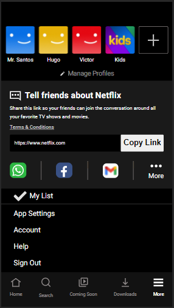

# Netflix Clone

## Technologies Used:
* HTML;
* CSS;
* GIT;
* GitHub;
* Vercel (Deploy).

## Standardizations:
* HTML: Semantic Tags;
* CSS: BEM (Block Element Modifier);
* GIT: Conventional Commits.

## Description:
This was a challenge from "Maratonas Academy", where we clone the mobile version of Netflix.

## Website:
The live version of the website can be accessed at: https://netflixmobile.vercel.app

## Screenshots:

